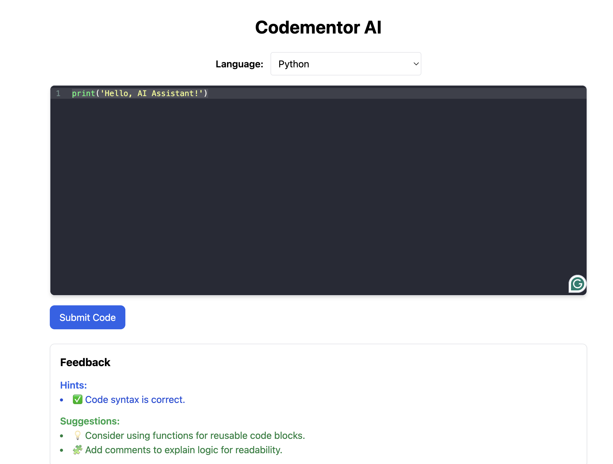

# 💡 Codementor AI

An intelligent **AI-powered code feedback platform** built using **FastAPI**, **React (Vite)**, and **Transformers (GPT-2)**.  
Codementor AI analyzes code submissions, detects syntax issues, and provides smart AI hints and improvement suggestions.

---

## 🚀 Live Demo

| Service | URL |
|----------|-----|
| 🖥️ **Frontend (Vercel)** | [https://codementor-ai.vercel.app](https:/codementor-ai-.vercel.app) |
| ⚙️ **Backend (Render)** | [https://codementor-ai-1.onrender.com](https://codementor-ai-1.onrender.com) |

> ✅ **Try it live:** Select a language, write code, and click “Submit” — Codementor AI will analyze and suggest improvements in real time.

---
📸 **Demo Preview**




## 🧩 Tech Stack

### 🖥️ Frontend
- **React (Vite + TypeScript)**
- **Tailwind CSS**
- **Axios** for API requests  
- Deployed on **Vercel**

### ⚙️ Backend
- **FastAPI**
- **SQLAlchemy** (SQLite DB)
- **Transformers (GPT-2)** for AI hints  
- Deployed on **Render**

---

## 🏗️ Local Setup Guide

1️⃣ Clone the Repository
```bash
git clone https://github.com/Deeksha7-wa/Codementor-AI.git
cd Codementor-AI
```

2️⃣ Setup Backend (FastAPI)
```bash
cd backend
pip install -r requirements.txt
uvicorn main:app --reload
Your backend will start at:
👉 http://127.0.0.1:8000
```

3️⃣ Setup Frontend (React + Vite)
```bash
cd frontend
npm install
npm run dev
Now visit 👉 http://localhost:5173
```

4️⃣ Environment Variables
In the frontend folder, create a .env file:
```
VITE_API_URL=http://127.0.0.1:8000
```
On Vercel, add:
```bash
VITE_API_URL=https://codementor-ai-1.onrender.com
```

🧾 Future Enhancements

✅ Support for Java, C++, and HTML/CSS

🔐 Add user authentication (login & profiles)

🧠 Improve AI model with DistilGPT-2 fine-tuning

☁️ Store user history on PostgreSQL (cloud)

👩‍💻 Author

Deeksha Wadhwa


